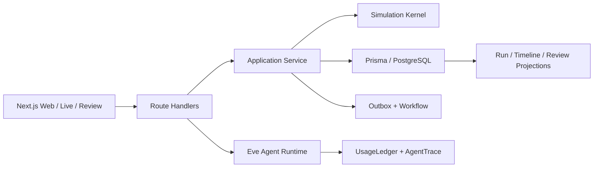

# ReadinessOS

ReadinessOS 是一个面向组织业务韧性和决策训练的模拟平台。用户可以运行可重复的业务事故演练，在动态信息边界下与 Agent 协作决策，并通过事件回放、证据评分和分支重跑验证处置能力。

## 本地启动

前置条件：

- Node.js `24.15.0`，项目根目录提供 `.nvmrc`；
- pnpm `11.7.0`；
- Docker Desktop。

```bash
nvm use
pnpm install
cp .env.example .env.local
pnpm dev:local
```

打开 `http://localhost:3000/login`。本地演示账号和密码由 `.env.local` 的
`AUTH_DEMO_EMAIL`、`AUTH_DEMO_PASSWORD` 定义。

## 5 分钟演示

1. 登录后选择 SaaS 支付服务故障场景，在 Studio 配置参与者并开始 Run。
2. 在 Live Workspace 提交一条处置 Action，观察事件、参与方状态与审批变化。
3. 打开 Review，按证据回放 Timeline，并创建一项整改措施。
4. 从 Review 创建 Run 分支，对比另一种处置路径。
5. 登录页可创建受限 Guest Demo：它使用独立租户和有时效的 Run，不能执行分支、Director Inject
   或 Agent Turn。

## 架构



## 安全与运行边界

- 访客按独立 Organization 隔离；来源键和 token 只持久化 HMAC。
- Guest Run 到期后写 API、租约与 Tick 不再推进。
- Agent 预算来自不可变 `UsageLedger`，覆盖 Turn、Token、工具、子 Agent 与费用。
- Eve Sandbox 对生产可用后端默认禁用网络出口；本地 `just-bash` 回退不视为隔离。

## 常用命令

```bash
pnpm db:up
pnpm db:migrate --name <migration-name>
pnpm db:seed
pnpm dev:local
pnpm test
pnpm verify
```

默认 Compose 数据库监听 `localhost:5433`，避免占用本机已有的 PostgreSQL 服务。

## 文档

- [MVP 工程计划](./plan.md)
- [实施任务清单](./tasks.md)
- [环境登记](./docs/environment.md)
- [事件目录](./docs/event-catalog.md)
- [发布与回滚 Runbook](./docs/release-runbook.md)
- [运行与事故 Runbook](./docs/operations-runbook.md)
- [MVP 发布就绪度](./docs/release-readiness.md)
- [ADR-010 Guest Demo 隔离](./docs/adr/010-guest-demo-isolation-and-expiration.md)
- [ADR-011 Agent 预算与 Sandbox](./docs/adr/011-agent-budget-ledger-and-sandbox.md)
